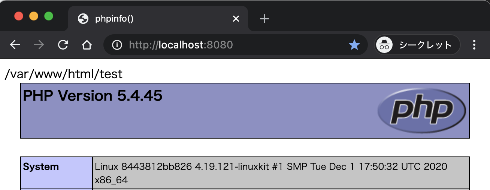
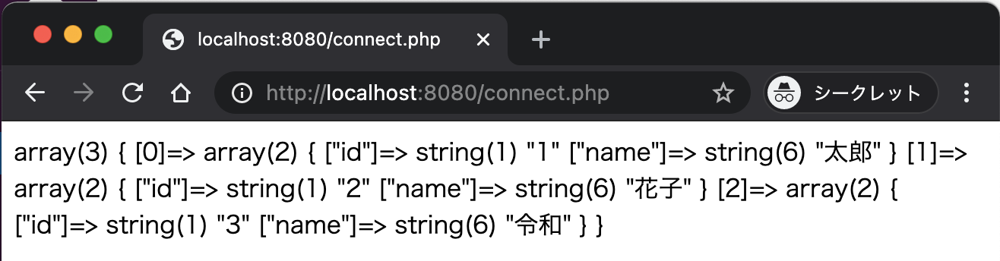
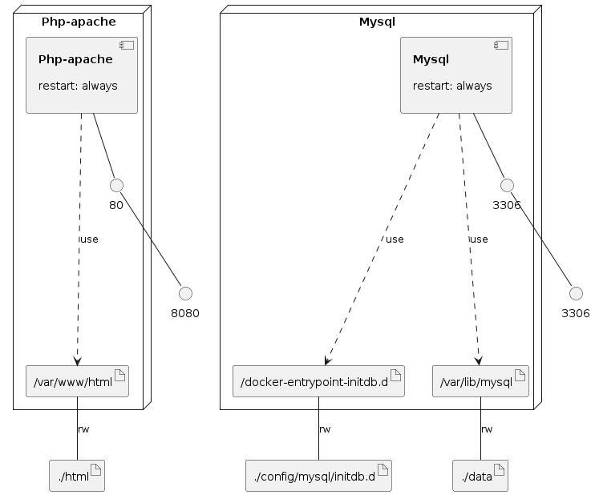

# docker-compose-sample

## Architecture


## Requirement

- Docker: 20.10.0
- docker-compose : 1.27.4

```shell
$ docker -v
Docker version 20.10.0, build 7287ab3
```

```shell
$ docker-compose -v
docker-compose version 1.27.4, build 40524192
```

## Docker-compose build

```shell
$ docker-compose build --no-cache
```

```shell
$ docker image ls          
REPOSITORY                                      TAG           IMAGE ID       CREATED         SIZE
docker-compose-sample_php-apache                latest        xxxxxxxxxxxx   3 minutes ago   512MB
docker-compose-sample_mysql                     latest        yyyyyyyyyyyy   8 minutes ago   217MB
```

## Docker-compose up

```shell
$ docker-compose up -d
```

```shell
$ docker-compose ps
               Name                             Command               State           Ports
----------------------------------------------------------------------------------------------------
docker-compose-sample_mysql_1        docker-entrypoint.sh mysql ...   Up      0.0.0.0:3306->3306/tcp
docker-compose-sample_php-apache_1   apache2-foreground               Up      0.0.0.0:8080->80/tcp
```

## Connection check

Access to [http://localhost:8080](http://localhost:8080)



Access to [http://localhost:8080/connect.php](http://localhost:8080/connect.php)



## Docker-compose stop

```shell
$ docker-compose stop
```

```shell
$ docker-compose ps
               Name                             Command               State    Ports
------------------------------------------------------------------------------------
docker-compose-sample_mysql_1        docker-entrypoint.sh mysql ...   Exit 0
docker-compose-sample_php-apache_1   apache2-foreground               Exit 0
```


## Docker-compose down

```
$ docker-compose down --rmi all --volumes

```

```
$ docker-compose ps
Name   Command   State   Ports
------------------------------
```

```
$ docker image ls
REPOSITORY   TAG       IMAGE ID   CREATED   SIZE
```


### Infrastructure model

